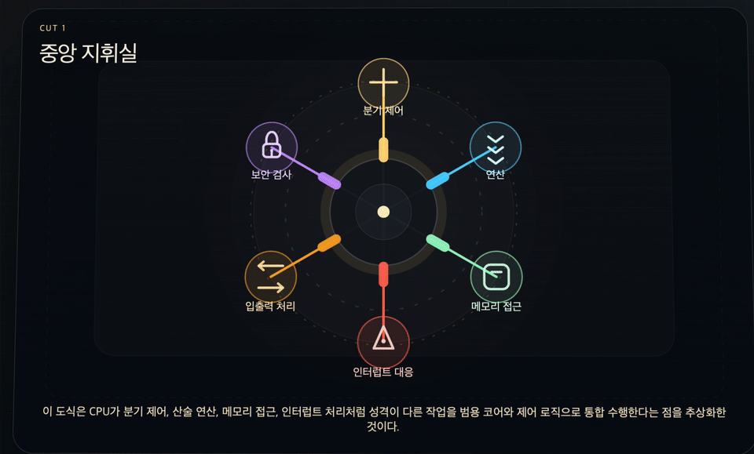
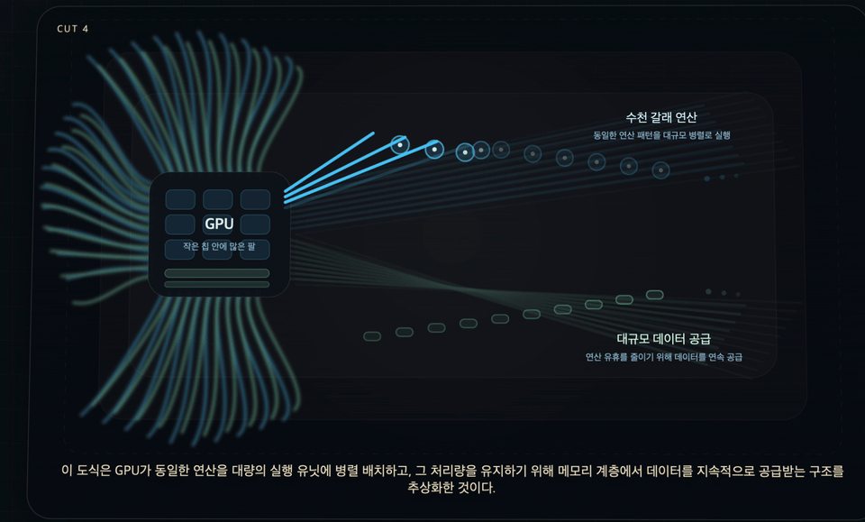
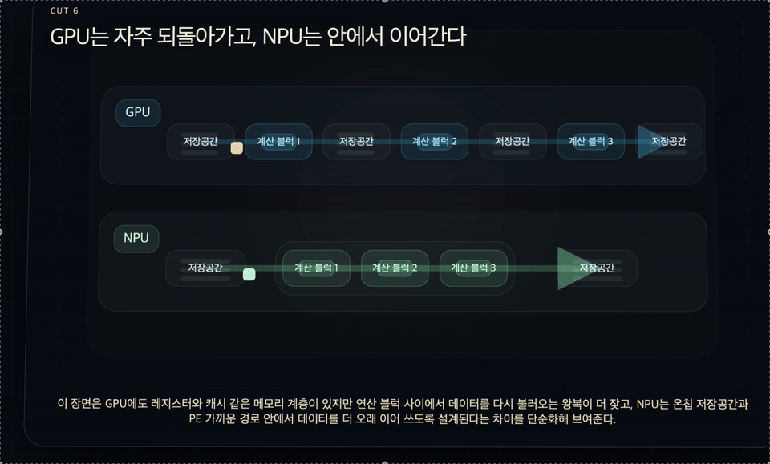

# Mini NPU Simulator

이 프로젝트는 엄밀한 의미의 NPU 구현이라기보다, NPU가 왜 필요한지를 설명하는 교육용 예제에 더 가깝다. 저장소의 코드는 입력 패턴과 필터의 대응 위치를 곱하고 그 결과를 누적하는 sum-of-products 계산을 직접 구현해, AI 연산의 기본 원리를 보여준다. 다만 실제 NPU를 구성하는 시스톨릭 어레이, 온칩 버퍼, 데이터 재사용, 짧은 데이터 이동 같은 하드웨어 구조까지 재현한 것은 아니다. 따라서 이 README는 이 프로젝트를 “NPU 자체의 시뮬레이터”보다는 “NPU가 다루는 계산 문제를 소개하는 입문용 모델”로 이해하는 관점에서 정리한다.

## 1. 프로젝트 개요

Mini NPU Simulator는 미션에서 요구한 방식대로, 입력 패턴과 필터의 대응 원소를 곱한 뒤 모두 더해 점수화하는 Python 콘솔 애플리케이션이다. 

이 구현은 total += pattern[i][j] * filt[i][j] 형태의 반복을 통해 입력 패턴이 Cross에 더 가까운지, X에 더 가까운지 판정한다. 수학적으로는 원소별 곱의 합(sum-of-products) 이고, 배열 프로그래밍 관점에서는 elementwise multiply 뒤 sum reduction으로 볼 수 있다. 여기서 중요한 점은 sum-of-products가 “무엇을 계산하는가”를 설명하는 수식적 형태이지, 곧바로 “어떤 하드웨어인가”를 뜻하지는 않는다는 것이다. CPU, GPU, DSP, 순수 Python 반복문도 모두 같은 계열의 계산을 수행할 수 있기 때문이다. 따라서 이 프로젝트는 “실제 NPU 하드웨어 구조”를 직접 재현한 시뮬레이터라기보다, 미션에서 설명한 패턴 판별 원리를 Python 반복문으로 구현한 교육용 프로그램으로 이해하는 편이 더 정확하다.

미션 본문에서는 이 과정을 입문 수준에서 MAC(Multiply-Accumulate)으로 설명하지만, 내가 구현한 코드를 더 엄밀하게 보면 각 반복 스텝은 multiply-accumulate 패턴을 따르고, 함수 전체는 sum-of-products / reduction 계산을 수행한다. 반면 실제 TPU/NPU 계열 가속기는 큰 matrix multiply unit, 시스톨릭 어레이, software-managed on-chip memory 같은 하드웨어 구조와 데이터플로우를 통해 이런 계산을 빠르게 수행한다. 그래서 이 README에서는 내가 구현한 요구사항 충족 코드와 실제 AI 가속기 구조를 분리해서 설명하려고 한다.

---

## 2. 실행 환경

- OS: macOS (Darwin Kernel Version 24.6.0)
- Shell: `/bin/zsh`
- Git: `git version 2.53.0`
- Language: Python 3.11 이상
- Library: Python 표준 라이브러리만 사용 (`json`, `time` 등)
- Main file: `main.py`
- Data file: `data.json`
- Project root: `~/dev/missions/mini-npu-simulator`
- 기준 실행 환경: Codyssey2026 README와 동일 기준으로 정리

---

## 3. 프로젝트 구조

```text
~/dev/missions/mini-npu-simulator/
├─ main.py
├─ README.md
└─ data.json
```

---

## 4. 수행 체크리스트

- [x] `main.py` 실행 가능
- [x] 사용자 입력 모드(3×3) 구현
- [x] JSON 분석 모드 구현
- [x] 라벨 정규화 구현
- [x] epsilon 기반 동점 처리 구현
- [x] 크기 검증 및 예외 처리 구현
- [x] 성능 분석 표 출력
- [x] 결과 요약 출력
- [x] 실패 원인 분석 작성
- [x] 시간 복잡도 분석 작성

---

## 5. 실행 방법

### 5-1. 프로젝트 루트로 이동

```bash
cd ~/dev/missions/mini-npu-simulator
```

### 5-2. 프로그램 실행

```bash
python3 main.py
```

### 5-3. 실행 흐름

- 프로그램 실행
- 모드 선택
- `1` 선택 시: 3×3 필터 2개와 패턴 입력 후 판정
- `2` 선택 시: `data.json` 로드 후 일괄 판정
- 각 모드 종료 전 성능 분석 출력
- `data.json` 모드에서는 마지막에 총 테스트 수 / 통과 수 / 실패 수 요약 출력

### 5-4. 사용자 입력 모드 예시

프로그램 실행 후 `1`을 입력하면 3×3 필터 A, 필터 B, 패턴을 순서대로 입력받는다.

예시 입력:

```text
1
0 1 0
1 1 1
0 1 0
1 0 1
0 1 0
1 0 1
1 0 1
0 1 0
1 0 1
```

### 5-5. JSON 분석 모드 예시

프로그램 실행 후 `2`를 입력하면 `data.json`을 로드하여 전체 패턴을 일괄 분석한다.

예시 입력:

```text
2
```

---

## 6. 검증 방법

| 항목 | 검증 방법 | 확인 내용 |
|---|---|---|
| 모드 1 정상 입력 | `python3 main.py` → `1` 선택 | 3×3 필터/패턴 입력 후 점수, 판정, 시간 출력 |
| 모드 1 오류 입력 | `python3 main.py` → `1` 선택 후 잘못된 열 수 입력 | 오류 메시지 출력 후 재입력 유도 |
| 모드 2 JSON 분석 | `python3 main.py` → `2` 선택 | 패턴별 PASS/FAIL, 성능 표, 최종 요약 출력 |
| 라벨 정규화 | `expected` 값에 `+`, `x` 사용 | 내부 비교가 `Cross`, `X` 기준으로 동작 |
| 동점 처리 | 점수 차이가 epsilon 미만인 케이스 확인 | `UNDECIDED` 반환 |
| 성능 분석 | 3×3, 5×5, 13×13, 25×25 측정 | 평균 시간(ms) 및 연산 횟수(N²) 출력 |

---

## 7. 구현 순서

1. 상수와 공통 유틸 함수 작성
2. 콘솔 입력용 3×3 행렬 입력 함수 작성
3. 라벨 정규화 함수 작성
4. MAC 연산 함수 작성
5. 점수 판정 함수 작성
6. 성능 측정 함수 작성
7. JSON 로드 및 검증 함수 작성
8. 사용자 입력 모드 구현
9. JSON 분석 모드 구현
10. 메인 메뉴 연결

---

## 8. 핵심 구현 요약

### 8-1. 라벨 정규화

- `+`는 `Cross`, `x`는 `X`로 변환했다.
- 필터 키의 `cross`, `x`도 각각 `Cross`, `X`로 통일했다.
- 프로그램 내부 비교는 항상 표준 라벨 `Cross`, `X` 기준으로 수행했다.

라벨 정규화는 `+`, `cross`, `x`처럼 서로 다른 표현을 내부 표준 라벨인 `Cross`, `X`로 통일하는 단계다.  
이 로직을 `normalize_label()`로 따로 뺀 이유는 비교 기준을 한 곳에서만 관리하기 위해서다.

분리하지 않고 각 위치에서 직접 처리하면 다음 문제가 생긴다.

- 어떤 곳은 `+`를 `Cross`로 바꾸고, 어떤 곳은 그대로 둘 수 있다.
- 필터 키 처리와 expected 처리 방식이 달라질 수 있다.
- 출력 로직과 비교 로직이 서로 다른 라벨 체계를 사용할 수 있다.

반대로 별도 함수로 분리하면 장점이 크다.

1. 단일 책임  
   - 라벨 표현 통일이라는 한 가지 역할만 맡긴다.

2. 재사용성  
   - 필터 키 정규화, expected 정규화, 출력 전 정리 모두 같은 함수를 쓸 수 있다.

3. 유지보수성  
   - 나중에 새 라벨을 추가하더라도 `normalize_label()`만 수정하면 된다.

4. 일관성  
   - PASS/FAIL 비교, 콘솔 출력, 내부 저장 라벨이 모두 같은 기준을 사용하게 된다.

즉 `normalize_label()`를 별도 함수로 분리한 이유는 “정규화 규칙을 코드 전체에 흩뿌리지 않고, 하나의 진입점에서 관리하기 위해서”라고 설명할 수 있다.

### 8-2. MAC 연산

- pattern[i][j] * filter[i][j]를 모든 위치에서 수행한 뒤 누적 합계를 구하는 방식으로 구현했다.
- NumPy 같은 외부 라이브러리는 사용하지 않고, 중첩 반복문으로 직접 구현했다.

이 구현은 사용자 입력 모드와 JSON 분석 모드에서 공통으로 사용하는 핵심 계산 함수다. 코드 수준에서는 mac(pattern, filt)가 모든 좌표 (i, j)를 순회하면서 pattern[i][j] * filt[i][j]를 계산하고, 그 결과를 total += ... 형태로 누적한다. 따라서 함수 전체를 수학적으로 보면 원소별 곱의 합(sum-of-products) 이고, 배열 프로그래밍 관점에서는 elementwise multiply + sum reduction이다.

미션 설명의 MAC 용어는 이 계산을 입문적으로 설명하기에는 적절하지만, 더 엄밀하게는 반복 한 스텝의 계산 패턴과 함수 전체의 연산 구조를 구분하는 편이 정확하다. 즉 total += pattern[i][j] * filt[i][j]의 한 번 실행은 multiply-accumulate 패턴으로 볼 수 있지만, mac() 함수 전체는 하나의 점수를 만드는 reduction 계산이다. 이 점을 구분해 두면, 내 코드가 “실제 하드웨어 MAC 어레이를 구현했다”가 아니라 “미션에서 요구한 위치별 곱셈과 합산 원리를 Python으로 구현했다”는 점을 명확히 설명할 수 있다.

또한 내가 만든 이 구현은 실제 NPU의 하드웨어 구조를 재현한 것은 아니다. 실제 TPU/NPU 계열은 대규모 matrix multiply unit, 시스톨릭 어레이, 로컬 데이터 재사용, software-managed on-chip memory를 이용해 동일 계열의 계산을 빠르게 수행한다. 반면 여기서 만든 것은 Python 실행기가 이중 반복문, 리스트 인덱싱, 부동소수점 누적을 직접 관리하는 교육용/알고리즘 수준 구현이다. 그래서 나는 이 프로젝트를 “계산 아이디어는 닮았지만 실행 구조는 다르다”라고 이해하고 있다.

이 미션에서 필터는 “기준 패턴”이고, 패턴 입력은 “검사 대상”이다. 1 × 1 = 1은 기준 필터가 강조한 위치와 입력이 실제로 일치하는 경우를 뜻하고, 1 × 0 = 0 또는 0 × 1 = 0은 그 위치가 겹치지 않는 경우를 뜻한다. 따라서 누적합이 클수록 입력이 해당 필터의 기준 패턴과 더 많이 겹친다고 해석할 수 있고, 나는 이 구현에서 그 값을 유사도 점수로 사용했다. 이 설명은 내가 이해한 미션의 판별 규칙과도 맞는다.

### 8-3. 동점 처리 정책

- 부동소수점 오차로 인해 점수가 거의 같은 경우가 발생할 수 있으므로 단순 `==` 비교 대신 epsilon 정책을 사용했다.
- `abs(score_cross - score_x) < 1e-9`이면 `UNDECIDED`로 처리했다.

부동소수점 수는 컴퓨터 내부에서 2진수 기반으로 표현된다.  
이때 10진수에서는 단순해 보이는 수라도 내부 표현 과정에서 정확히 떨어지지 않을 수 있고, 여러 번의 연산을 거치면 아주 미세한 오차가 누적될 수 있다.

예를 들어 사람이 보기에는 같아 보이는 두 값이 실제 메모리 값에서는 아래처럼 다를 수 있다.

- `0.9000000000000000`
- `0.8999999999999999`

이 두 값을 단순 `==` 또는 `>` 비교만으로 처리하면, 사실상 동점인 경우를 억지로 승패로 나눌 수 있다.  
그래서 `abs(score_cross - score_x) < 1e-9` 같은 허용오차 기준을 두고, 차이가 아주 작으면 같은 값으로 간주한다.

즉 epsilon 정책이 필요한 이유는 다음과 같다.

1. 부동소수점 표현의 미세한 흔들림을 흡수하기 위해
2. 사실상 동점인 케이스를 오판정하지 않기 위해
3. 비교 정책을 코드상에서 명시적으로 고정하기 위해

이 미션에서는 그 결과를 `UNDECIDED`로 처리하도록 설계했다.

동점 자체를 처리하는 기준은 둘 다 epsilon 기반이라는 점에서 같다.  
차이는 “출력 의미”와 “요구사항의 관점”에 있다.

- mode1: 임의의 두 입력 필터 비교 → A/B/판정 불가
- mode2: 표준 필터 비교 + expected 대조 → Cross/X/UNDECIDED

모드 1은 사용자가 직접 필터 A와 필터 B를 입력하는 구조다.  
여기서 프로그램은 두 필터가 실제로 `Cross`, `X`인지 보장할 수 없다.  
즉 모드 1에서는 필터의 의미보다 “첫 번째 입력 필터 vs 두 번째 입력 필터”라는 비교가 중요하다.

반면 모드 2는 `data.json`에서 `Cross` 필터와 `X` 필터를 명시적으로 읽는다.  
여기서는 비교 대상 자체가 의미를 가진 표준 라벨이므로, 판정 결과도 표준 라벨 기준으로 유지하는 것이 자연스럽다.

### 8-4. 성능 측정 방식

- I/O와 파일 읽기 시간을 제외하고, 연산 함수 호출 구간만 10회 반복 측정했다.
- 평균 시간은 ms 단위로 출력했다.
- 성능 표에는 `크기(N×N) / 평균 시간(ms) / 연산 횟수(N²)`를 함께 표기했다.

시간 측정은 “프로그램 전체 실행 시간”이 아니라 “MAC 연산 자체가 얼마나 걸리는가”를 보기 위한 것이므로, 입력/출력과 파일 읽기 시간을 의도적으로 제외했다.

내가 잡은 경계는 다음과 같다.

- 포함한 구간:
  - `mac(pattern, filt)` 또는 이를 포함한 비교 함수 호출 구간
- 제외한 구간:
  - `input()`으로 사용자 입력받는 시간
  - `print()`로 화면에 출력하는 시간
  - `json.load()`로 파일을 읽는 시간
  - 루프 바깥의 메뉴 처리 시간

예를 들어 `measure_average_ms()` 내부에서는 아래와 같은 경계를 잡는다.

```python
start = time.perf_counter()
func(*args)
end = time.perf_counter()
```

즉 `start`는 연산 함수 호출 직전에 찍고, `end`는 연산 함수가 끝나자마자 찍는다.  
이렇게 해야 성능 표가 “사용자의 타이핑 속도”나 “콘솔 출력량”이 아니라, 순수한 계산 비용을 보여주게 된다.

### 8-5. JSON 매칭 구조

JSON 분석 모드에서는 `patterns`의 키가 `size_{N}_{idx}` 형태라고 가정했다.  
예를 들어 `size_13_1`은 “13×13 크기의 첫 번째 패턴”이라는 뜻이다.

이 구조를 사용한 이유는 패턴 데이터 안에 크기 정보를 별도 필드로 중복 저장하지 않고, 키 이름 자체에서 크기를 바로 읽어낼 수 있기 때문이다.  
구현 순서는 다음과 같다.

1. `extract_size_from_pattern_key(pattern_key)`에서 문자열을 `_` 기준으로 분리한다.
2. `size_13_1`이면 두 번째 토큰인 `13`을 꺼내 정수로 변환한다.
3. 추출한 `N`을 기준으로 `filters_by_size[N]` 또는 `size_N` 필터 그룹을 선택한다.
4. 선택한 필터와 패턴 입력이 모두 `N×N`인지 `validate_square_matrix()`로 다시 검증한다.
5. 검증 통과 시에만 `Cross` 필터와 `X` 필터 각각에 대해 MAC 점수를 계산한다.

이렇게 설계한 장점은 다음과 같다.

- 패턴마다 어떤 필터를 써야 하는지 자동으로 결정할 수 있다.
- 5×5, 13×13, 25×25처럼 크기가 다른 케이스를 하나의 루프로 처리할 수 있다.
- 잘못된 키 형식이나 크기 불일치를 케이스 단위 FAIL로 분리할 수 있다.

즉 “패턴 키 → 크기 추출 → 맞는 필터 선택” 흐름을 기준으로 설계하면, JSON 분석 모드의 자동 채점 구조가 단순해진다.

---

## 9. 모드 1 실행 결과

### 9-1. 정상 입력 테스트

```text
$ python main.py
=== Mini NPU Simulator ===

[모드 선택]
1. 사용자 입력 (3x3)
2. data.json 분석
선택: 1

#---------------------------------------
# [1] 필터 입력
#---------------------------------------
필터 A (3줄 입력, 공백 구분)
1 0 1
0 1 0
1 0 1
필터 B (3줄 입력, 공백 구분)
0 1 0
1 1 1
0 1 0

#---------------------------------------
# [2] 패턴 입력
#---------------------------------------
패턴 (3줄 입력, 공백 구분)
1 1 1
1 1 1
1 1 1

#---------------------------------------
# [3] MAC 결과
#---------------------------------------
A 점수: 5.0
B 점수: 5.0
연산 시간(평균/10회): 0.001196 ms
판정: 판정 불가

#---------------------------------------
# [성능 분석] 평균/10회
#---------------------------------------
크기        평균 시간(ms)           연산 횟수(N^2)
---------------------------------------------
3x3      0.001402            9
```

### 9-2. 해석

위 입력에서는 패턴이 모든 칸이 1인 행렬이기 때문에, 필터 A와 필터 B 모두 동일한 위치 수만큼 점수를 얻어 `5.0` 대 `5.0` 동점이 발생했다.  
프로그램은 epsilon 기반 비교 정책에 따라 이 경우 승자를 강제로 선택하지 않고 `판정 불가`로 처리했다.

### 9-3. 입력 오류 테스트

```text
$ python main.py
=== Mini NPU Simulator ===

[모드 선택]
1. 사용자 입력 (3x3)
2. data.json 분석
선택: 1

#---------------------------------------
# [1] 필터 입력
#---------------------------------------
필터 A (3줄 입력, 공백 구분)
0 1
입력 형식 오류: 각 줄에 3개의 숫자를 공백으로 구분해 입력하세요.
1 1 1
0 1 0
1 1 1
필터 B (3줄 입력, 공백 구분)
```

### 9-4. 해석

열 개수가 부족한 입력이 들어와도 프로그램이 바로 종료되지 않고, 오류 메시지를 출력한 뒤 해당 줄의 재입력을 유도하도록 구현했다.  
이 동작으로 모드 1의 최소 입력 검증 요구사항을 충족했다.

---

## 10. 모드 2 실행 결과

```text
$ python main.py
=== Mini NPU Simulator ===

[모드 선택]
1. 사용자 입력 (3x3)
2. data.json 분석
선택: 2

#---------------------------------------
# [1] 필터 로드
#---------------------------------------
✓ size_5 필터 로드 완료 (Cross, X)
✓ size_13 필터 로드 완료 (Cross, X)
✓ size_25 필터 로드 완료 (Cross, X)

#---------------------------------------
# [2] 패턴 분석
#---------------------------------------
--- size_5_1 ---
Cross 점수: 1.000000
X 점수: 9.000000
판정: X | expected: X | PASS

--- size_5_2 ---
Cross 점수: 9.000000
X 점수: 1.000000
판정: Cross | expected: Cross | PASS

--- size_5_3 ---
Cross 점수: 9.000000
X 점수: 2.200000
판정: Cross | expected: Cross | PASS

--- size_13_1 ---
Cross 점수: 22.500000
X 점수: 22.500000
판정: UNDECIDED | expected: X | FAIL

--- size_13_2 ---
Cross 점수: 4.600000
X 점수: 25.000000
판정: X | expected: X | PASS

--- size_13_3 ---
Cross 점수: 25.000000
X 점수: 4.600000
판정: Cross | expected: Cross | PASS

--- size_25_1 ---
Cross 점수: 1.000000
X 점수: 49.000000
판정: X | expected: X | PASS

--- size_25_2 ---
Cross 점수: 49.000000
X 점수: 1.000000
판정: Cross | expected: Cross | PASS

#---------------------------------------
# [3] 성능 분석
#---------------------------------------
크기        평균 시간(ms)           연산 횟수(N^2)
---------------------------------------------
3x3       0.001486            9
5x5       0.002579            25
13x13     0.012216            169
25x25     0.041550            625

#---------------------------------------
# [4] 결과 요약
#---------------------------------------
총 테스트: 8개
통과: 7개
실패: 1개

실패 케이스:
- size_13_1: expected=X, predicted=UNDECIDED
```

### 10-1. 해석

- 총 8개 케이스 중 7개는 기대 라벨과 최종 판정이 일치하여 PASS였다.
- `size_13_1`은 `Cross 점수`와 `X 점수`가 동일하게 계산되어 `UNDECIDED`로 처리되었고, expected 값이 `X`였기 때문에 FAIL이 되었다.
- 이 결과는 MAC 계산 자체의 오류라기보다, 동점 처리 정책과 데이터 기대값이 충돌한 사례를 보여준다.

---

## 11. 성능 분석

### 11-1. 성능 표

```text
크기        평균 시간(ms)           연산 횟수(N^2)
---------------------------------------------
3x3       0.001486            9
5x5       0.002579            25
13x13     0.012216            169
25x25     0.041550            625
```

### 11-2. 해석

- `mac(pattern, filt)`는 N×N 입력의 모든 좌표를 한 번씩 방문하므로, 한 번의 점수 계산 비용은 기본적으로 N²에 비례한다. 따라서 입력 크기가 커질수록 실행 시간도 이중 반복문 구조에 따라 함께 증가하며, 이론적인 시간 복잡도는 O(N²)로 볼 수 있다.

- 표의 측정값은 전용 하드웨어의 MAC 처리 속도가 아니라, 현재 Python 구현이 실제로 실행된 시간이다. 즉 반복문 제어, 리스트 인덱싱, 객체 접근, 누적 연산 같은 Python 수준의 실행 비용이 함께 포함된 결과다.

- 따라서 이 성능 표는 “입력 크기가 커질수록 이 구현이 어떻게 느려지는가”를 보여주는 자료로 해석하는 것이 적절하다. 복잡도 해석 자체는 O(N²)로 유효하지만, 그 의미는 현재 순수 Python 구현의 계산 구조에 한정된다고 보는 편이 정확하다.

## 12. 결과 리포트

이번 구현은 미션의 핵심 요구사항인 패턴 점수 계산, 라벨 정규화, 동점 처리, 입력 검증, JSON 일괄 분석을 모두 수행하도록 구성했다. 코드 구조도 `mac()`, `normalize_label()`, `judge_scores()`, `analyze_single_pattern()`처럼 역할별로 나누어, 점수 계산과 판정, 예외 처리의 책임이 분리되도록 정리했다. 이런 기준에서 보면 이 프로그램은 미션에서 요구한 Python 기반 패턴 판별기로서 필요한 기능을 충실하게 갖추고 있다.

실행 결과는 총 8개 패턴 중 7개 PASS, 1개 FAIL이었다. 유일한 실패 케이스인 `size_13_1`은 계산 오류라기보다 판정 정책의 결과로 해석하는 편이 맞다. 해당 입력에서는 `Cross` 점수와 `X` 점수가 같게 계산되어 `UNDECIDED`가 반환되었고, 데이터의 기대값은 `X`였기 때문에 최종적으로 FAIL이 되었다. 즉 이 실패는 라벨 정규화나 크기 검증의 문제가 아니라, epsilon 기반 동점 처리 규칙을 엄격하게 적용했을 때 발생한 사례라고 볼 수 있다.

성능 측면에서는 입력 크기가 커질수록 `mac()`의 이중 반복문이 더 많은 좌표를 방문해야 하므로 비용이 빠르게 증가한다. 특히 큰 입력에서는 단순히 곱셈 횟수만 많아지는 것이 아니라, Python 인터프리터가 반복문 제어, 리스트 인덱싱, 객체 접근, 누적 갱신을 계속 처리해야 한다는 점이 병목으로 작용한다. 따라서 현재 구현의 성능은 전용 하드웨어의 처리 속도라기보다, 순수 Python으로 위치별 곱셈과 합산을 수행했을 때의 비용으로 이해하는 것이 적절하다.

이 점을 종합하면, 이 프로젝트는 실제 NPU 하드웨어를 재현한 시뮬레이터라기보다 AI 계산의 기본 원리를 설명하는 교육용 모델에 더 가깝다. 함수 수준에서는 sum-of-products 계산을 수행하지만, 실제 NPU가 사용하는 시스톨릭 어레이, 온칩 메모리, 데이터 재사용 같은 하드웨어 구조까지 포함하고 있지는 않기 때문이다. 앞으로 성능을 더 개선하려면 같은 패턴에 대한 중복 순회를 줄이고, 핫 루프 안의 Python 수준 작업을 줄이며, 필요하다면 벡터화 라이브러리나 더 낮은 수준의 실행 방식으로 옮기는 방향을 검토하는 것이 현실적이라고 판단했다.

---

## 13. 트러블슈팅

### 문제 1. 3×3 입력 중 열 개수가 맞지 않아 예외가 발생할 수 있었음

- 문제: 사용자가 `0 1`처럼 숫자를 2개만 입력할 수 있음
- 원인 가설: 행별 길이 검증이 없어서 잘못된 입력이 그대로 저장될 수 있음
- 확인: `parse_matrix_row()`에서 입력 길이를 검사하지 않으면 이후 연산에서 인덱스 오류가 발생할 수 있었음
- 해결: 각 줄 입력 시 기대 개수와 실제 개수를 즉시 비교하고, 오류 메시지를 출력한 뒤 재입력을 유도함

### 문제 2. JSON 비교 시 같은 의미의 라벨인데 FAIL이 날 수 있었음

- 문제: `+`, `cross`, `x` 같은 라벨 표현 차이 때문에 PASS/FAIL 비교가 흔들릴 수 있음
- 원인 가설: `expected` 값과 필터 키를 문자열 그대로 비교하면 표기 차이를 처리하지 못함
- 확인: 비교 전에 `normalize_label()`을 거치도록 하니 기준이 `Cross`, `X`로 통일됨
- 해결: 모든 라벨을 먼저 표준 라벨로 정규화한 뒤 판정 및 PASS/FAIL 비교를 수행함

## 14. 제출 전 확인

- [x] `main.py` 실행 가능
- [x] `data.json` 분석 가능
- [x] README 실행 방법 작성 완료

## 부록 A. CPU → GPU → NPU의 등장 배경

## A-1. CPU → GPU → NPU 흐름

AI 계산 구조를 이해하려면, NPU가 등장한 배경을 먼저 살펴볼 필요가 있다.  
전체 흐름은 보통 **CPU → GPU → NPU** 순서로 정리할 수 있다.

### CPU: 범용 연산 중심

CPU(Central Processing Unit)는 운영체제 실행, 프로그램 제어, 분기 처리, 입출력 관리처럼 **범용 작업을 폭넓게 처리하는 프로세서**다.  
복잡한 제어와 다양한 명령 처리에는 강하지만, 같은 형태의 수치 연산을 매우 많이 반복하는 작업에서는 비효율적일 수 있다.

예를 들어 AI 계산에서는 다음과 같은 작업이 자주 등장한다.

- 큰 벡터와 행렬의 곱셈
- 같은 연산의 대량 반복
- 많은 데이터에 대한 병렬 처리

이런 계산도 CPU로 수행할 수는 있지만, CPU는 원래부터 이런 대규모 병렬 수치 연산만을 위해 설계된 장치는 아니기 때문에 입력 크기가 커질수록 한계가 드러난다.

### GPU: 대규모 병렬 수치 연산 가속

GPU(Graphics Processing Unit)는 원래 그래픽 처리를 위해 발전했지만,  
동일한 계산을 많은 데이터에 반복 적용하는 구조가 AI의 행렬 연산과 잘 맞는다.

딥러닝에서는 입력 데이터와 가중치 사이의 계산이 결국 대량의 곱셈과 덧셈으로 이어지는데, GPU는 이를 CPU보다 훨씬 많은 병렬 연산 자원으로 처리할 수 있다.  
그래서 AI 학습과 추론이 본격적으로 확산되던 시기에 GPU는 사실상 표준 가속기로 자리 잡았다.

흐름을 요약하면 다음과 같다.

- CPU는 전체 프로그램을 제어하는 범용 프로세서에 가깝다.
- GPU는 대규모 수치 계산을 빠르게 처리하는 병렬 연산 장치에 가깝다.

### NPU: AI 계산에 특화된 전용 가속기

NPU(Neural Processing Unit)는 이름 그대로 **신경망 연산을 더 효율적으로 처리하기 위해 특화된 프로세서**다.  
GPU도 AI 계산을 잘 수행하지만, NPU는 여기서 더 나아가 **AI 추론, 행렬 연산, 데이터 이동 최적화**에 초점을 맞춘다.

핵심은 단순히 연산량이 많다는 점이 아니라,  
AI에서 자주 등장하는 계산 패턴에 맞게 하드웨어 구조와 데이터 흐름을 더 직접적으로 최적화한다는 점이다.

대표적으로 실제 AI 가속기들은 다음과 같은 방향으로 설계된다.

- 큰 matrix multiply 연산에 특화
- 같은 데이터를 여러 번 재사용하도록 구성
- 메모리 이동 비용을 줄이기 위한 on-chip memory 활용
- 시스톨릭 어레이 같은 구조를 통한 연산 효율 향상
- 전력 대비 성능 효율 개선

즉 GPU가 범용 병렬 가속기라면, NPU는 그보다 더 **AI 전용 성격이 강한 가속기**에 가깝다.

### 왜 CPU → GPU → NPU로 발전했는가

이 흐름은 결국 **AI 계산량 증가** 때문에 나타났다.

1. CPU만으로는 대규모 AI 연산을 빠르게 처리하기 어려웠다.
2. GPU가 병렬 연산으로 이를 크게 가속했다.
3. 이후 모델 규모가 더 커지고, 추론 속도와 전력 효율이 중요해지면서 NPU 같은 전용 가속기가 필요해졌다.

즉 발전 방향은 단순한 세대교체라기보다,

- **범용성 중심의 CPU**
- **병렬성 중심의 GPU**
- **AI 특화 최적화 중심의 NPU**

로 이동해 왔다고 정리할 수 있다.

### 이 프로젝트와의 관계

이 관점에서 보면, 이 프로젝트는 실제 NPU 하드웨어를 재현한 시뮬레이터라기보다 교육용 프로그램에 가깝다. 병렬 처리 자체만 놓고 보면 일반적인 대규모 병렬 계산은 GPU의 성격에 더 가깝기 때문이다. 현재 구현은 미션에서 요구한 방식대로 **입력 패턴과 필터의 대응 원소를 곱한 뒤 모두 더해 점수화하는 원리**를 Python 반복문으로 구현한 형태다.

## A-2. HTML 시각화 부록

Python 콘솔 프로그램만으로는 CPU, GPU, NPU의 구조 차이와 데이터 흐름 차이를 충분히 설명하기 어렵기 때문에, 별도의 HTML 기반 시각화 자료 `cpu-gpu-npu-journey.html`을 제작했다. 대표 장면은 GIF로 추출해 함께 정리했다.

- 원본 시각화: `cpu-gpu-npu-journey.html`
- 스토리보드: `docs/cpu-gpu-npu-storyboard.md`
- GIF 변환 스크립트: `videos/make_gifs.sh`
- GIF 출력 경로: `videos/gifs/*.gif`
- 최신 MOV 원본:
- `CUT 1`: `videos/cut1_v3.mov`
- `CUT 4`: `videos/cut4_v3.mov`
- `CUT 6`: `videos/cut6_v2.mov`
- `CUT 8`: `videos/cut8_v2.mov`

아래 GIF는 CPU의 범용성, GPU의 블록 병렬 처리, GPU의 메모리 병목, NPU의 시스톨릭 어레이 흐름을 요약해서 보여준다.

### CUT 1. 중앙 지휘실

최신 MOV: `videos/cut1_v3.mov`



### CUT 4. 원래 행렬곱과 GPU 블록 행렬곱 비교

최신 MOV: `videos/cut4_v3.mov`



### CUT 6. GPU의 다음 병목

최신 MOV: `videos/cut6_v2.mov`



### CUT 8. NPU는 파동처럼 계산한다

최신 MOV: `videos/cut8_v2.mov`


---

## 부록 B. 왜 2차원 배열을 1차원 배열로 펴도 Python에서는 큰 이득이 없을 수 있는가

이 프로젝트에는 2차원 접근 방식과 평탄화 기반 1차원 접근 방식을 비교하는 실험용 모드가 있다. 이 모드에서는 동일한 입력과 동일한 반복 횟수에 대해 다음 두 방식을 비교한다.

- 2차원 배열 접근: `pattern[i][j] * filt[i][j]`
- 2차원 배열을 `flatten`으로 1차원으로 바꾼 뒤 순회: `for p, f in zip(pattern_flat, filt_flat): ...`

이 비교의 핵심은 “이미 1차원으로 준비된 데이터”와 “2차원 데이터를 매번 1차원으로 변환해야 하는 경우”를 구분하는 데 있다. 1차원 순회 자체는 단순할 수 있지만, 현재 프로젝트처럼 Python 리스트를 `extend()`로 평탄화하는 비용까지 포함하면 전체 실행 시간은 달라질 수 있다. 따라서 이 부록은 `flatten = 항상 더 빠름`이라는 직관이 순수 Python 환경에서는 왜 그대로 성립하지 않을 수 있는지 설명하는 데 목적이 있다.

### B-1. 왜 flatten이 항상 빠르지 않은가

겉으로 보면 1차원 배열 순회가 더 단순해 보이므로 더 빠를 것처럼 보일 수 있다. 그러나 현재 비교 실험은 “이미 준비된 1차원 배열”끼리의 비교가 아니라, 2차원 리스트를 먼저 1차원으로 바꾼 뒤 그 결과를 순회하는 전체 비용을 측정한다.

```python
mac(pattern, filt)
mac_flat_with_flatten(pattern, filt)
```

두 번째 방식은 내부에서 먼저 다음 변환을 수행한다.

```python
pattern_flat = flatten_matrix(pattern)
filt_flat = flatten_matrix(filt)
```

이후에야 1차원 순회가 시작된다. 따라서 1차원 루프 자체가 단순하더라도, 앞단의 `extend()` 기반 변환 비용이 함께 추가된다. 반면 2차원 방식은 별도 변환 없이 곧바로 계산을 수행한다. 순수 Python에서는 이 차이가 의미 있게 나타날 수 있다.

### B-2. Python `list`에서 flatten의 이점이 제한될 수 있는 이유

Python의 `list`는 C의 `int[]`, `float[]`처럼 숫자값이 연속 저장된 저수준 배열과는 다르다. 일반적으로는 Python 객체에 대한 참조를 담는 구조에 가깝다. 따라서 2차원 리스트를 1차원으로 평탄화하더라도, NumPy나 C에서 기대하는 수준의 연속 메모리 최적화가 그대로 나타나는 것은 아니다.

이 점 때문에 현재 병목은 “메모리가 1차원인가 2차원인가”보다 다음과 같은 Python 수준의 비용에서 더 크게 나타날 수 있다.

- 평탄화 과정에서 발생하는 리스트 확장 비용
- 반복문 제어와 객체 접근 비용
- 같은 데이터를 여러 번 순회하는 비용

즉 이 프로젝트에서는 1차원 구조 자체보다 “변환 비용을 포함한 전체 실행 경로”를 함께 보는 것이 더 중요하다.

### B-3. 실제로 의미 있었던 최적화

#### (1) `zip`으로 2차원 인덱스 접근 줄이기

기존 구현은 `pattern[i][j]`, `filt[i][j]` 형태의 2차원 인덱스 접근을 매번 수행한다.

```python
def mac(pattern, filt):
    size = len(pattern)
    total = 0.0

    for i in range(size):
        for j in range(size):
            total += pattern[i][j] * filt[i][j]

    return total
```

이를 `zip` 기반 순회로 바꾸면, 인덱스 계산을 직접 하지 않고 행과 원소를 바로 순회할 수 있다.

```python
def mac_zip(pattern, filt):
    total = 0.0

    for pattern_row, filt_row in zip(pattern, filt):
        for pattern_value, filt_value in zip(pattern_row, filt_row):
            total += pattern_value * filt_value

    return total
```

이 방식은 코드를 단순하게 만들고, Python 수준의 인덱스 접근을 줄이는 효과가 있다. 큰 구조 변화 없이도 적용할 수 있는 미세 최적화에 가깝다.

#### (2) 1차원으로 평탄화한 뒤 한 번만 순회하기

2차원 구조를 1차원 리스트로 미리 평탄화해 두고, 곱셈과 누적을 한 번의 루프로 처리하는 방법도 생각할 수 있다.

```python
def flatten_matrix(matrix):
    flat = []

    for row in matrix:
        flat.extend(row)

    return flat


def mac_flat(pattern_flat, filt_flat):
    total = 0.0

    for pattern_value, filt_value in zip(pattern_flat, filt_flat):
        total += pattern_value * filt_value

    return total
```

이 방식은 데이터가 이미 1차원으로 준비된 경우에는 단순하고 자연스럽다. 그러나 현재 프로젝트처럼 원본이 2차원 리스트라면, 평탄화 비용까지 포함한 전체 성능을 기준으로 판단해야 한다. 따라서 이 방식은 항상 우위라고 단정할 수 없다.

#### (3) 필터의 0이 아닌 위치만 미리 뽑아두기

이 프로젝트에서 가장 효과가 컸던 최적화는 필터 전처리다. `+`, `x` 필터는 0이 많은 희소(sparse) 구조이므로, `filt[i][j] == 0`인 위치는 계산에서 제외할 수 있다.

```python
def compile_filter(filt):
    active = []

    for row_index, row in enumerate(filt):
        for col_index, value in enumerate(row):
            if value != 0:
                active.append((row_index, col_index, value))

    return active


def mac_sparse(pattern, active_filter):
    total = 0.0

    for row_index, col_index, value in active_filter:
        total += pattern[row_index][col_index] * value

    return total
```

예를 들어 `25×25` 행렬은 전체 좌표가 625개이지만, `+` 필터의 활성 위치는 49개뿐이다. 따라서 전체 좌표를 순회하는 대신 활성 좌표만 검사하면 된다. 순수 Python에서는 이런 방식처럼 반복 횟수 자체를 줄이는 최적화가 가장 직접적인 효과를 낸다.

#### (4) 같은 필터를 여러 번 쓸 때 전처리 결과 재사용하기

2번 모드에서는 같은 `Cross` 필터와 `X` 필터를 여러 패턴에 반복 적용한다. 이때 매 패턴마다 필터 전체를 다시 순회하기보다, 시작할 때 한 번만 전처리해 두고 그 결과를 재사용하는 편이 훨씬 효율적이다.

```python
compiled_cross = compile_filter(cross_filter)
compiled_x = compile_filter(x_filter)

score_cross = mac_sparse(pattern, compiled_cross)
score_x = mac_sparse(pattern, compiled_x)
```

이 프로젝트에서 실질적으로 의미가 있었던 최적화는 다음과 같이 정리할 수 있다.

- `zip`으로 인덱스 접근을 줄이기
- 희소한 필터의 0이 아닌 위치만 전처리해 계산하기
- 같은 필터를 반복 사용할 때 전처리 결과를 재사용하기

이 가운데 특히 반복 횟수 자체를 줄이는 전처리와 재사용 전략이 가장 효과적이었다.

### B-4. 실험 결과는 어떻게 해석해야 하는가

예를 들어 비교 실험의 결과가 다음처럼 나올 수 있다.

```text
2차원 배열            3.357311            65536
flatten+1차원         4.399214            65536
```

이 결과는 이상한 것이 아니다. 이 실험은 1차원 순회 자체만 비교하는 것이 아니라, 2차원 배열을 1차원으로 변환한 뒤 그 결과를 순회하는 전체 비용을 측정하기 때문이다. 따라서 앞단의 변환 비용이 크면, 최종적으로는 2차원 방식이 더 빠르게 나타날 수 있다.

정리하면 순수 Python에서는 다음과 같이 해석하는 것이 적절하다.

- 이미 1차원으로 준비된 데이터라면 1차원 순회가 유리할 수 있다.
- 하지만 2차원 리스트를 매번 1차원으로 바꾸는 비용까지 포함하면 결과는 달라질 수 있다.
- 현재 비교 실험은 “변환 + 1차원 순회”의 전체 비용을 비교하는 방식에 가깝다.
- 즉 `flatten = 무조건 빠름`은 순수 Python 문맥에서는 성립하지 않는다.

### B-5. flatten이 더 중요해지는 환경

flatten 또는 contiguous layout이 진짜 중요한 환경은 다음과 같다.

- NumPy `ndarray`
- `array`, `memoryview`
- C/C++
- Cython
- Numba
- GPU / NPU용 packed buffer

이 환경에서는 원소가 실제로 연속 메모리에 저장되고, 루프도 Python 인터프리터보다 더 낮은 수준에서 실행된다. 이 경우 flatten과 contiguous access는 실제 성능 향상으로 이어질 수 있다.

반대로 현재 프로젝트처럼 Python 리스트와 반복문 중심의 구조에서는 flatten이 강력한 메모리 최적화라기보다 하나의 표현 방식에 가깝다. 특히 원본이 2차원 리스트라면, flatten의 이점은 변환 비용과 함께 평가해야 한다.

### B-6. C에서 flatten이 자주 언급되는 이유

C에서 flatten이 최적화 문맥에서 자주 언급되는 이유를 간단히 덧붙이면 다음과 같다. C의 2차원 배열은 row-major 방식으로 연속 저장되는 경우가 많기 때문에, “2차원 배열은 원래 비연속적이다”라고 단정할 수는 없다.

예를 들어 다음과 같은 배열은

```c
int a[2][3] = {
    {1, 2, 3},
    {4, 5, 6}
};
```

메모리 관점에서는 거의 `1 2 3 4 5 6`처럼 이어져 있다고 볼 수 있다. 다만 “연속 저장”과 “1차원 버퍼처럼 직접 다룬다”는 것은 같은 의미가 아니다.

- `a[i][j]`는 2차원 의미를 유지한 채 접근하는 표현이다.
- `flat[i * N + j]`는 같은 메모리를 1차원 버퍼처럼 직접 계산해서 접근하는 표현이다.

그래서 C에서 flatten이 자주 언급되는 이유는 대체로 다음과 같다.

- 단일 버퍼를 더 직접적으로 다루기 쉽다.
- `flat[i * N + j]`처럼 주소 계산이 명시적이라 저수준 최적화 설명이 쉬워진다.
- 함수 인자, 라이브러리, GPU API와 연결하기 편하다.
- `int **`처럼 행별 포인터로 나뉜 비연속 구조를 피하는 데 유리하다.

즉 C에서 flatten이 중요하다는 말은 “2차원 배열이 원래 비연속적이어서”라기보다, “단일 연속 버퍼를 더 예측 가능하게 다루고 비연속 포인터 구조를 피하기 쉬워서”에 가깝다.

### B-7. 최종 요약

이 부록의 핵심 결론은 다음 한 문장으로 정리할 수 있다.

> 순수 Python 리스트 기반 구현에서는, 이미 1차원으로 준비된 데이터라면 1차원 순회가 유리할 수 있다. 하지만 2차원 배열을 매번 1차원으로 평탄화해야 한다면 그 변환 비용까지 포함해서 봐야 하며, 이 경우에는 오히려 2차원 접근이 더 빠를 수도 있다.
